# Olympic Dataset (120 years, From Kaggle) - Wins and Trends Analysis

## Overview
Analysis of the olympic games, wins, sports, participation etc. Dataset is taken from Kaggle. Quality of the dataset is amazing with authentic data. 

## Analysis Questions
The following questions were introduced for the olympic dataset ranging from simple questions to insightful analysis and trends. They have been grouped as such by a divider line.

**1.**	What is the ratio of male to female athletes?  
**2.**	What is the average age of athletes?  
**3.**	What is the average height and weight of athletes?  
**4.**	How many athletes are there per sport?  
**5.**	How many athletes are there per country/team?  
**6.**	How many medals of each type (Gold, Silver, Bronze) have been awarded?  
**7.**	How many athletes participated in each Olympic year?  
________________________________________  
**8.**	Which countries have won the most medals overall?  
**9.**	Which sports have the highest participation by gender?  
**10.**	What is the average age of medal winners?  
**11.**	What is the average height and weight per sport?  
**12.**	Which athletes competed in multiple Olympics?  
**13.**	Which cities hosted the most athletes?  
________________________________________  
**14.**	How has male vs female participation changed over the years?  
**15.**	How has the number of athletes per country changed over time?  
**16.**	How has average age/height/weight of athletes changed over decades?  
**17.**	How has medal distribution per country changed over time?  
**18.**	Which sports have grown or declined in popularity over time?  
________________________________________  
**19.**	What is the medal probability by age group (<20, 20–25, 25–30, >30)?  
**20.**	Which countries dominate specific sports?  
**21.**	Is there a correlation between athlete height/weight and winning a medal in specific sports?  
**22.**	Which athletes have the longest Olympic careers?  
**23.**	Are there countries that excel in multiple sports versus those specialized in one sport?  
**24.**	How do physical characteristics vary by sport and medal status?  
**25.**	Are there patterns in medal wins by season (Summer vs Winter)?

## Clean Up Data

- Data is already clean so extra work needed. NULL values were ignored as there were not much anyways.

## Analysis

### 1. Male to Female segmentation

**🖥️ Query**: [1_male_to_female_ratio.sql](scripts/1_male_to_female_ratio.sql)

- Categorized athletes based on male to female ratio

**📈 Visualization:**

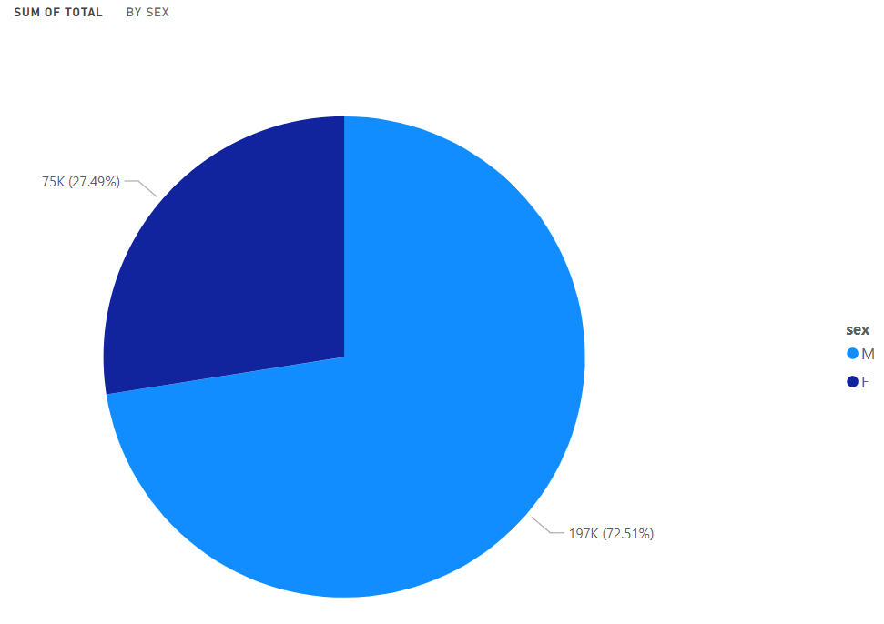

📊 **Key Findings:**
- Around 70% of atheletes who participated in the entire 120 years were male and around 30% were females

### 2. Average age of atheletes
**🖥️ Query**: [2_average_age_athletes.sql](scripts/2_average_age_athletes.sql)

- Found the average age of all athletes to date

**📈 Visualization:** 

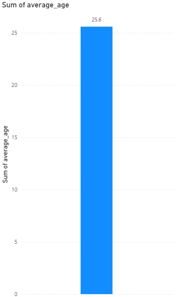

📊 **Key Findings:**  
- The average age of all the athletes were around 25 years

### 3. Average height/weight of athletes
🖥️ Query: [3_average_height_weight_athletes.sql](scripts/3_average_height_weight_athletes.sql)

- Identified customers at risk of churning
- Analyzed last purchase patterns
- Calculated customer-specific metrics

**📈 Visualization:**

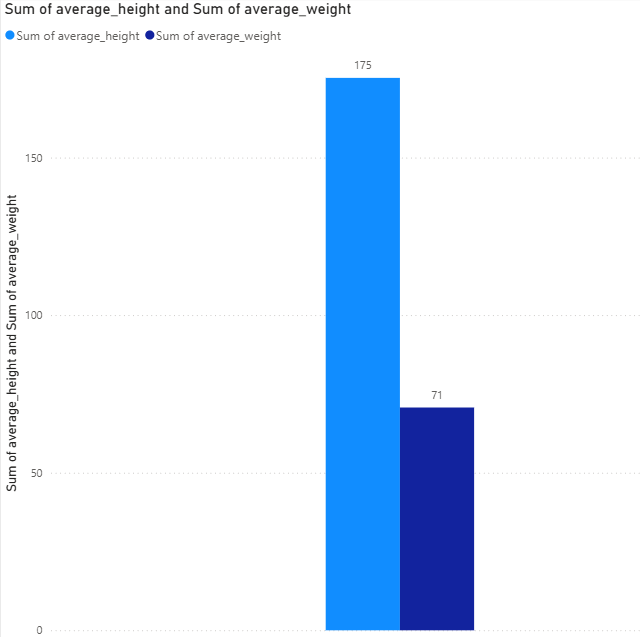

📊 **Key Findings:**  
- Average height is 175 CM or 5'7 Feet tall.  
- Average weight is 71 KG. 

### 4. Average height/weight of athletes
🖥️ Query: [4_athletes_per_sport.sql](scripts/4_athletes_per_sport.sql)

- Finding the total number of athletes per sport

**📈 Visualization:**

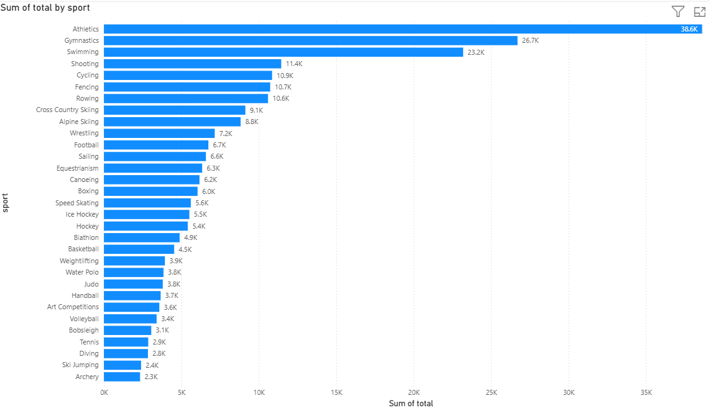

📊 **Key Findings:**  
- Athletics has the most number of athletes at 36.6K 
- Gymnastics is a far second coming at 26.7K
- Swimming at third with 23.2K 

### 5. Athletes per Country
🖥️ Query: [5_athletes_per_country.sql](scripts/5_athletes_per_country.sql)

- Finding the total number of athletes per country

**📈 Visualization:**

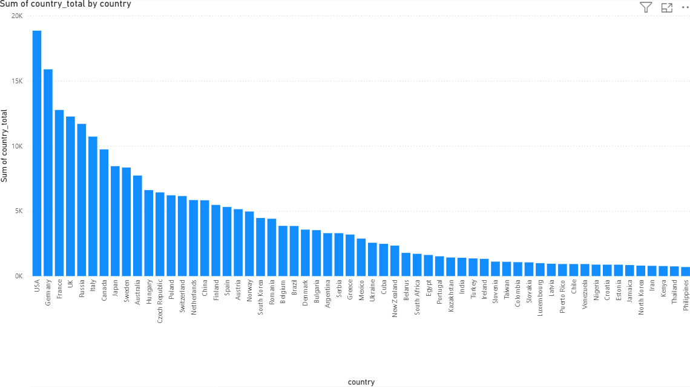

📊 **Key Findings:**  
- USA has by far the most athletes with almost reaching 20K
- Germany and France comes in 2nd and 3rd place

### 6. Total medal types awarded
🖥️ Query: [6_medal_types_awarded_total.sql](scripts/6_medal_types_awarded_total.sql)

- Finding the total number medals awarded by type

**📈 Visualization:**

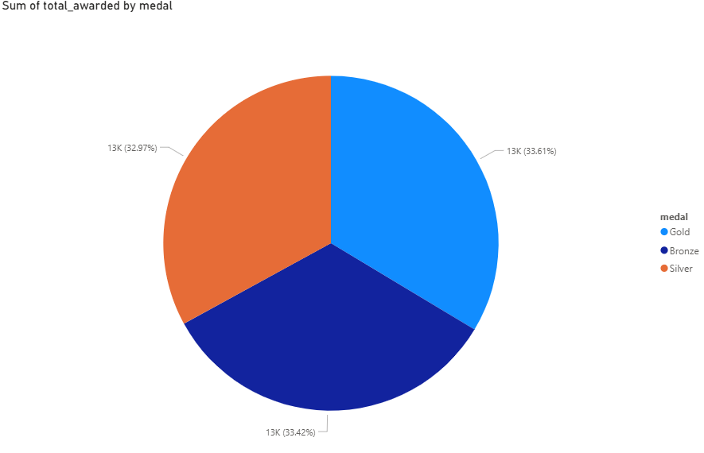

📊 **Key Findings:**  
- Well they are awarded equally. You always have 1st, 2nd and 3rd after all. Probably should not have included this here.
- Total medals awarded were 13k each.

### 7. Athlete Participation each Year
🖥️ Query: [7_athlete_participation_each_year.sql](scripts/7_athlete_participation_each_year.sql)

- Finding the total athlete participation by year

**📈 Visualization:**

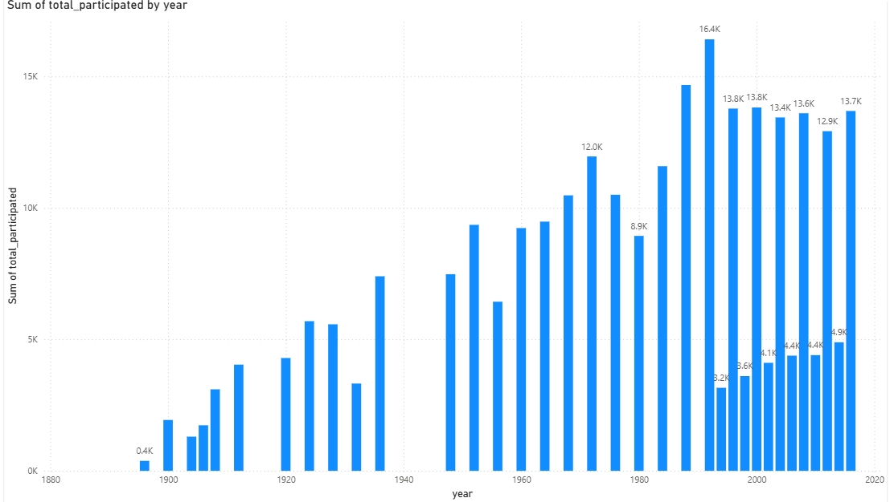

📊 **Key Findings:**  
- There seems to be a huge gap during the 1940s.
- Assuming the olympics did not take place during that time period

### 7. Medals won most by Country
🖥️ Query: [8_medals_won_most_by_country.sql](scripts/8_medals_won_most_by_country.sql)

- Finding which countries win the most medals using Geogprahic chart

**📈 Visualization:**

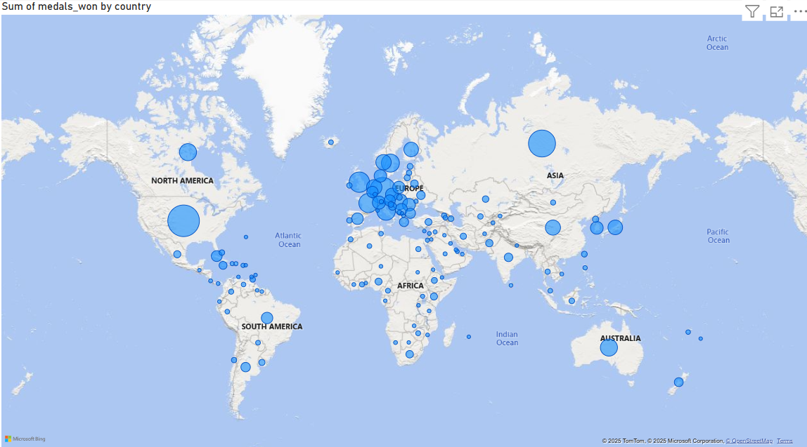

📊 **Key Findings:**  
- USA has the biggest circle. They have won most of the medals in the Olympics

### 9. Sports Participation by Gender
🖥️ Query: [8_medals_won_most_by_country.sql](scripts/8_medals_won_most_by_country.sql)

- Finding which gender dominates which sport

**📈 Visualization:**

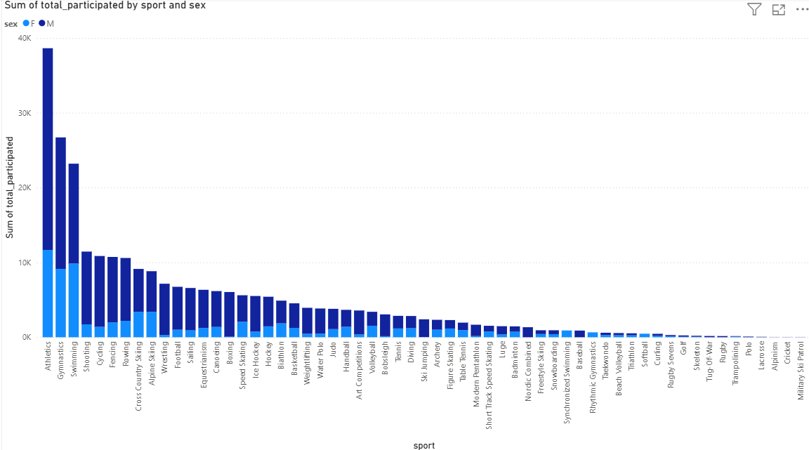

📊 **Key Findings:**  
- Mostly dominated by Male participants
- Tennis has almost 50/50 split
- Synchronized Swimming has all Females

### 10. Medal Winners average Age
🖥️ Query: [10_average_age_medal_winners.sql](scripts/10_average_age_medal_winners.sql)

- Finding which gender dominates which sport

**📈 Visualization:**

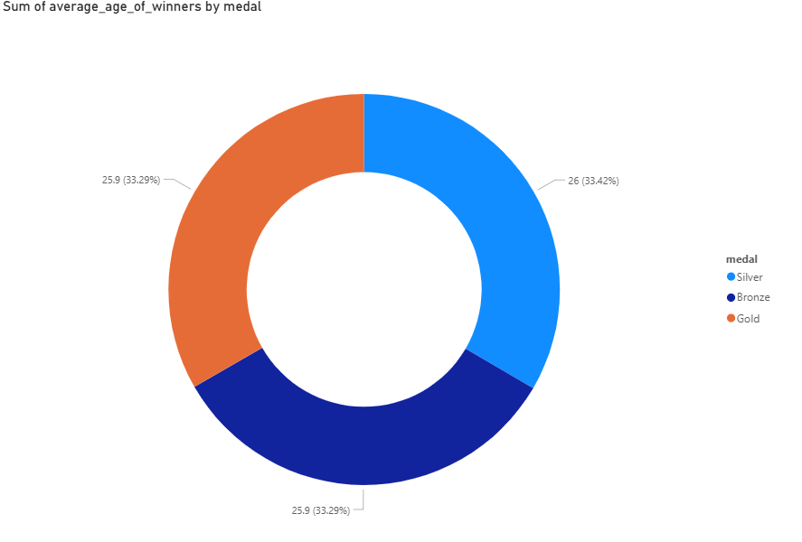

📊 **Key Findings:**  
- 26 year olds mostly win the medals
- Even split among all medal types

### 11. Average Height/Weight per Sport
🖥️ Query: [11_average_height_weight_per_sport.sql](scripts/11_average_height_weight_per_sport.sql)

- Finding the average height/weight per sport

**📈 Visualization:**

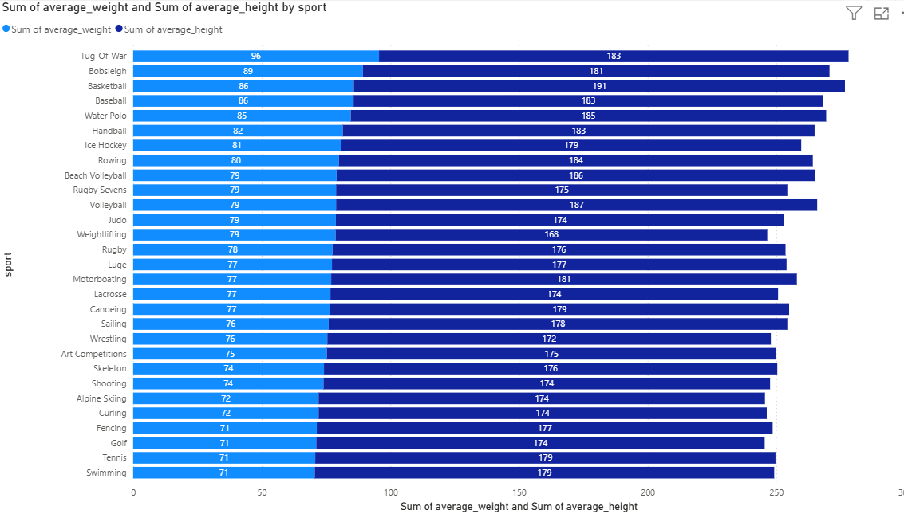

📊 **Key Findings:**  
- Basketball has the highest height compared to other sports
- Tug of war has the highest weight

### 12. Athletes that have competed multiple times
🖥️ Query: [12_athletes_competed_multiple_olympics.sql](scripts/12_athletes_competed_multiple_olympics.sql)

- Finding athletes who have competed multiple times

**📈 Visualization:**

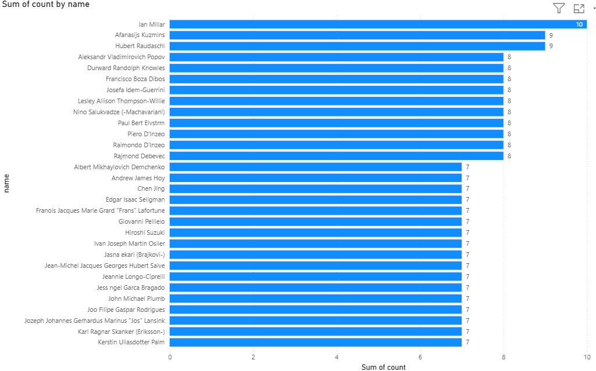

📊 **Key Findings:**  
- Ian Millar has competed a total of 10 times in Equestrianism
- Afanasjis (Shooting) and Hubert (Sailing) are the next two with 9 times each.

### 13. Cities with the most athletes
🖥️ Query: [13_cities_with_most_athletes.sql](scripts/13_cities_with_most_athletes.sql)

- Finding athletes who have competed multiple times

**📈 Visualization:**

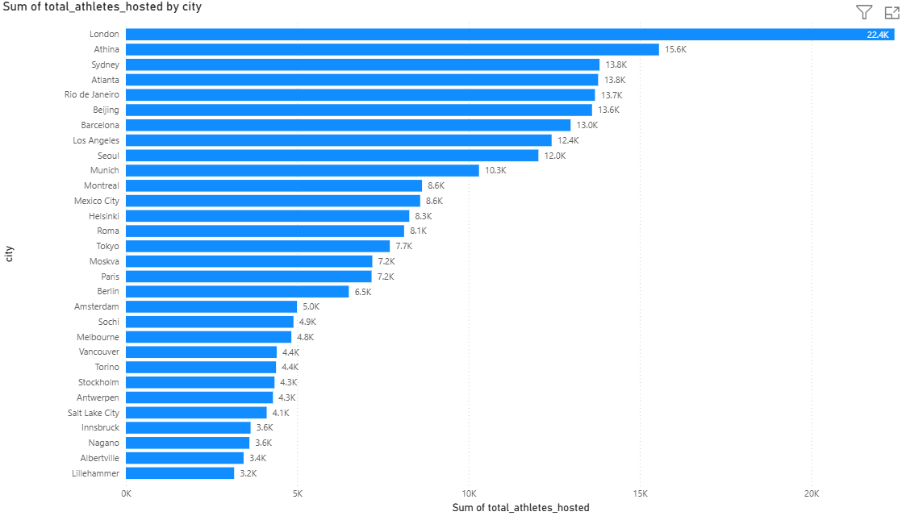

📊 **Key Findings:**  
- London has the most amount of athletes with 22.4K
- Chamonix has the least with only 490 (could not fit chart had to scroll down in MS powerBI)

### 14. Male and Female participation over the years
🖥️ Query: [14_male_female_participation_over_the_years.sql](scripts/14_male_female_participation_over_the_years.sql)

- Finding athletes who have competed multiple times

**📈 Visualization:**

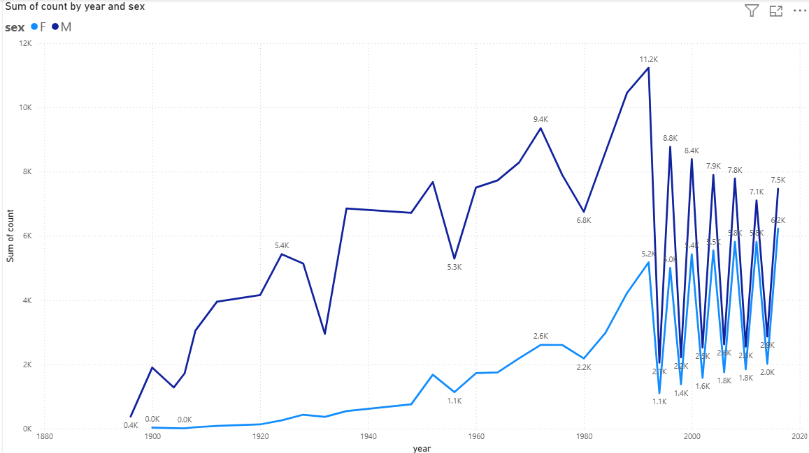

📊 **Key Findings:**  
- Males always had a high participation rate in general
- Females have slowly been increasing over the years with the highest being 6.2K.
- The male ratio has become less dominant over the year and beinging to even out or be closer to the Females

### 15. Athletes per Country Over Time
🖥️ Query: [15_athletes_per_country_over_time.sql](scripts/15_athletes_per_country_over_time.sql)

- Finding the number of atheletes over time from each countries. Only 5 countires were shown as there are way too many 

**📈 Visualization:**

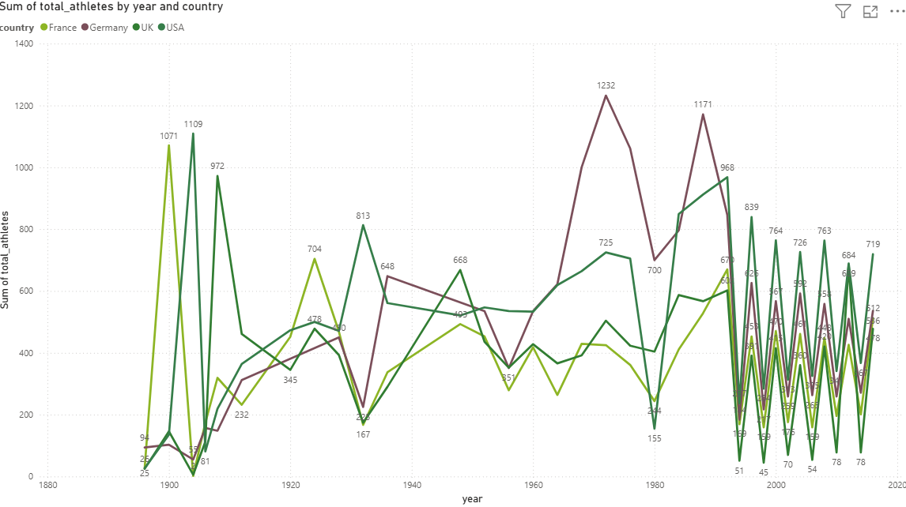

📊 **Key Findings:**  
- Germany peaked twice for athletes participated at a given olympic from 1960-2000

### 16. Average Height, Weight, Age over time
🖥️ Query: [16_average_height_weight_age_over_the_years.sql](scripts/16_average_height_weight_age_over_the_years.sql)

- Finding the Average Height, Weight, Age over time

**📈 Visualization:**

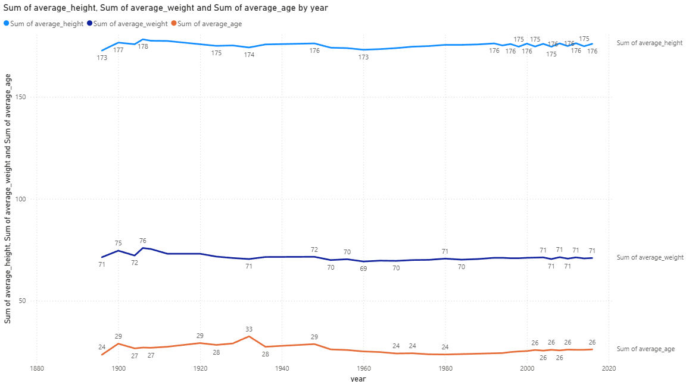

📊 **Key Findings:**  
- All 3 look very much consistent.
- For age, it only peaked once to 33 years but then mostly remained at around 25.

### 17. Medals won per Country over time
🖥️ Query: [17_medal_per_country_over_time.sql](scripts/17_medal_per_country_over_time.sql)

- Finding the medals won per Country over time

**📈 Visualization:**

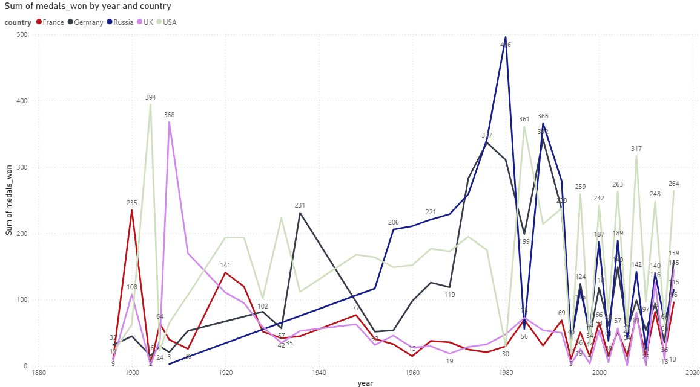

📊 **Key Findings:**  
- Russia won the most medals around the 1980 Olympic Games
- USA has been winning medals more consistently
over the years

## Technical Details
- **Database:** PostgreSQL
- **Analysis Tools:** PostgreSQL, Dbeaver, PgAdmin4
- **Visualization:** Microsoft PowerBI for charts

### 18. Sports By Popularity
🖥️ Query: [18_sports_by_popularity.sql](scripts/18_sports_by_popularity.sql)

- Finding which sports are most popular by counting the participants number in the initial year vs the last

**📈 Visualization:**

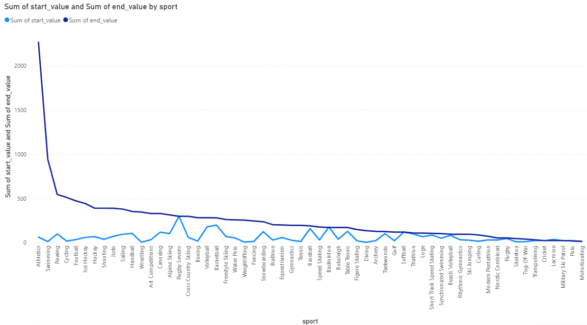

📊 **Key Findings:**  
- Athletics, swmimming and rowing have become the most popular with more participants now than when it started

### 19. Medal winning probability by Age Group
🖥️ Query: [19_medal_probabilty_age_group.sql](scripts/19_medal_probabilty_age_group.sql)

- Finding which age groups are more likely to win medals

**📈 Visualization:**

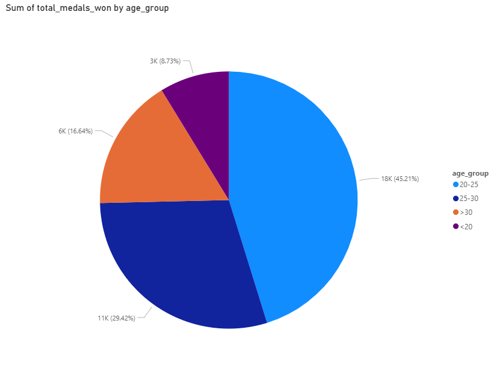

📊 **Key Findings:**  
- 20-25 age group are the most likely to win a medal at 45%
- 25-30 age group come in 2nd at 29% chance of winning medals
- Young adults are basically in their peak athletic form
- Teenager below 20 are least likely to win a medal

### 20. Countries dominating by sport
🖥️ Query: [20_countries_dominating_sport.sql](scripts/20_countries_dominating_sport.sql)

- Finding which countries dominate which sport

**📈 Visualization:**

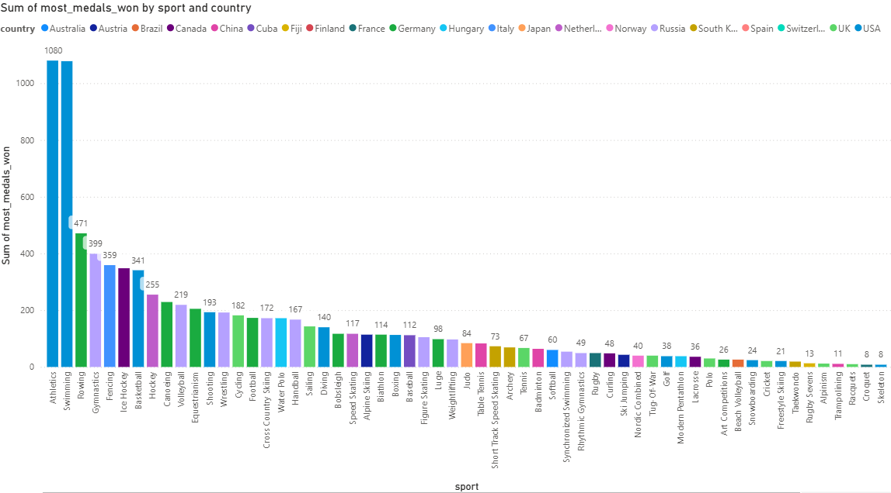

📊 **Key Findings:**  
- USA dominates both Athletics and Swimming by a large margin winning over a 1000 medals in both and is the only country to do so in any sport

### 21. Height correlation with Medals per Sport
🖥️ Query: [21_height_correlation_with_medals_per_sport.sql](scripts/21_height_correlation_with_medals_per_sport.sql)

- Finding the correlation of height of medals winnners per sport

**📈 Visualization:**

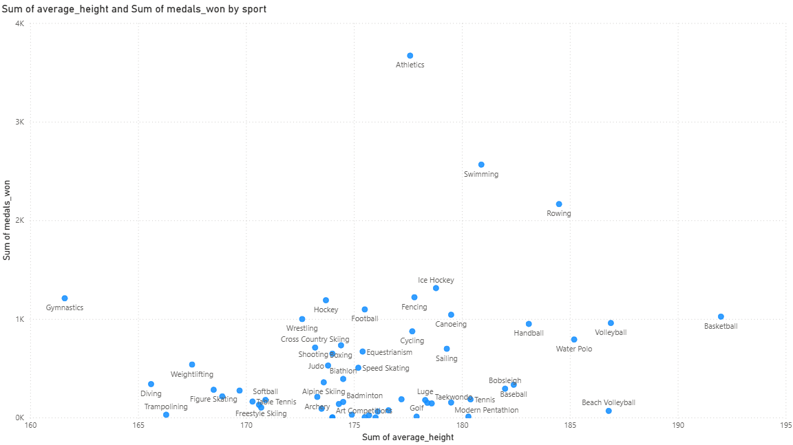

📊 **Key Findings:**  
- 175 to 185 cm have the most amount of sports won with athletics coming on top with around 178 cm

### 22. Athletes with the longest careers
🖥️ Query: [22_athletes_with_long_careers.sql](scripts/22_athletes_with_long_careers.sql)

- Finding the athletes and the career time in years

**📈 Visualization:**

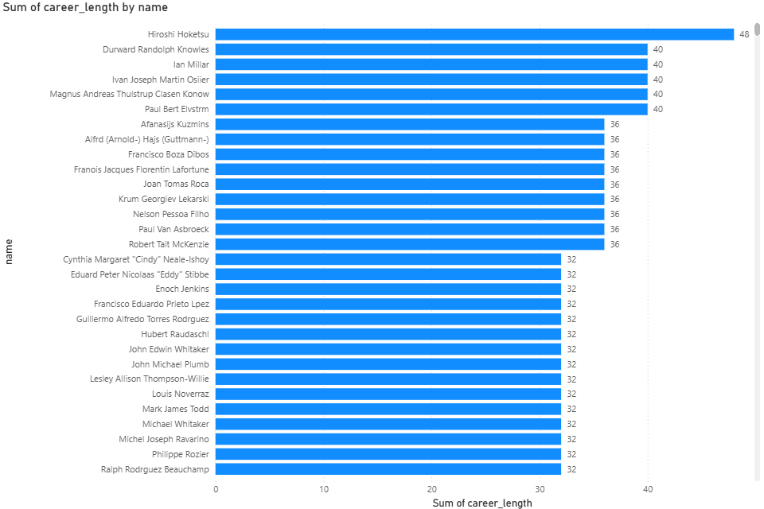

📊 **Key Findings:**  
- Hiroshi Hoketsu has the longest career going at it for 48 years as an Equestrian 

### 23. Countries specialized in multiple Sports
🖥️ Query: [23_countries_specialized_in_multiple_sports.sql](scripts/23_countries_specialized_in_multiple_sports.sql)

- Finding which country specializes in more than one sport. Less ratio = multiple specialization. More = only in one sport

**📈 Visualization:**

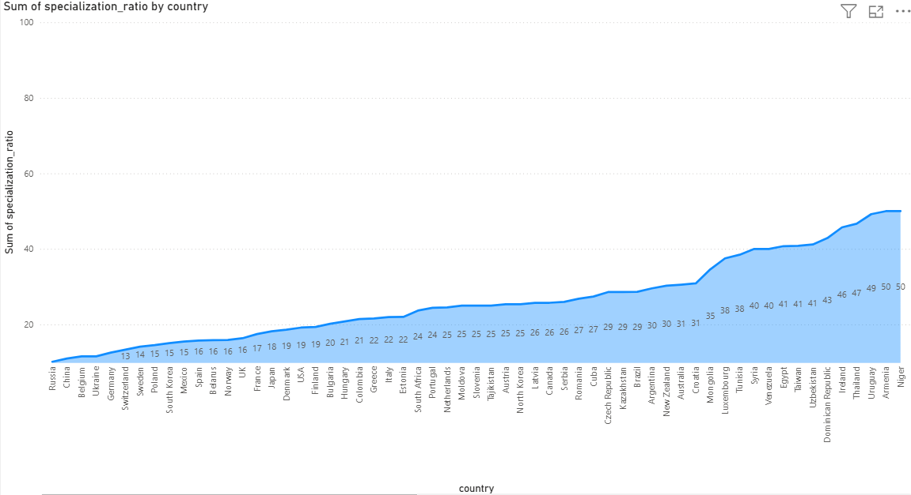

📊 **Key Findings:**  
- Russia, China and Belgium are the top 3 countries that do more than one sport spanning almost every sport there is

### 24. Physical attributes by medal type
🖥️ Query: [24_physical_attributes_by_medal_type.sql](scripts/24_physical_attributes_by_medal_type.sql)

- Finding the correlation of physical attributes by type of medal won

**📈 Visualization:**

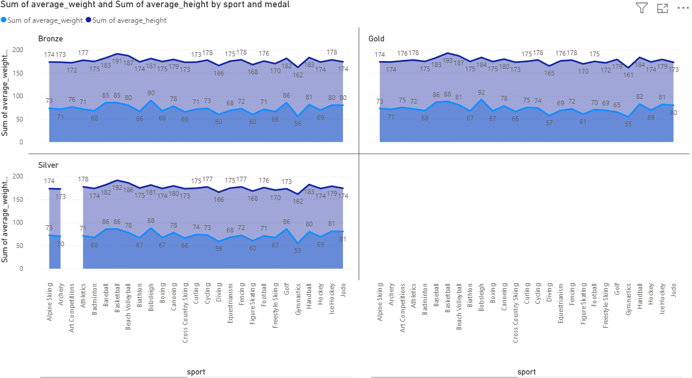

📊 **Key Findings:**  
- No much difference in physicial attributes for different type of medal winners. All very similar and within range

### 25.1. Medal wins by season
🖥️ Query: [25.1_medal_wins_by_season.sql](scripts/25.1_medal_wins_by_season.sql)

- Finding the amount of medals won by season

**📈 Visualization:**

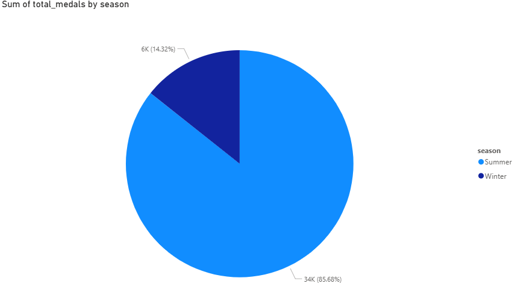

📊 **Key Findings:**  
- 85% of all medals won are in the Summer season compared to like 15% for winter
- People really don't like playing in the Winter

### 25.2. Medal type wins by season
🖥️ Query: [25.2_medal_type_wins_by_season.sql](scripts/25.2_medal_type_wins_by_season.sql)

- Finding the amount of medals won by season

**📈 Visualization:**

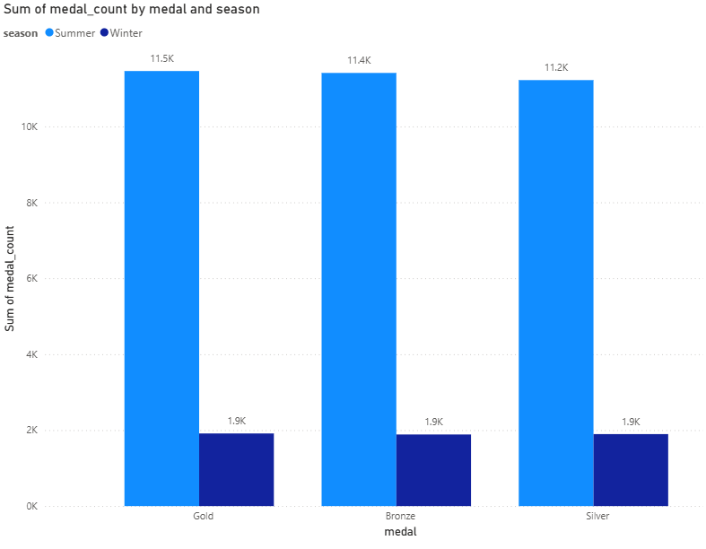

📊 **Key Findings:**  
- As shown before Summer has the most wins

### 25.3. Summer Winter Medal wins over time
🖥️ Query: [25.2_medal_type_wins_by_season.sql](scripts/25.2_medal_type_wins_by_season.sql)

- Finding the amount of medals won by season

**📈 Visualization:**

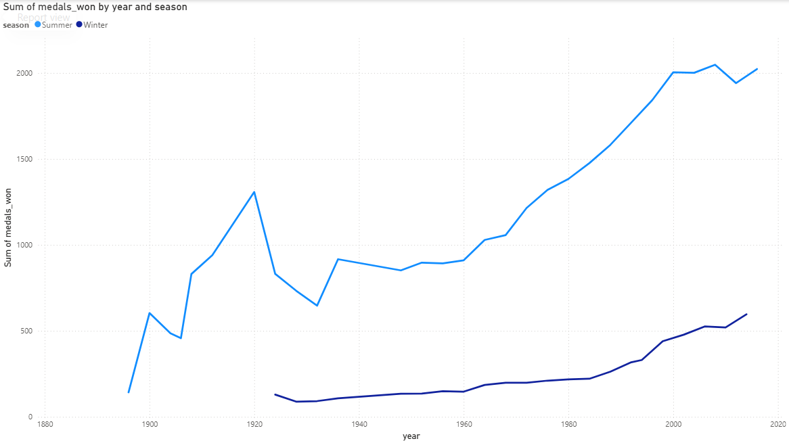

📊 **Key Findings:**  
- Summer always have won more medals and have continued to win more medals over time
- Winter 2014 has the only winter time that won the most medals with 592

### 25.4. Countries dominating by Season
🖥️ Query: [25.4_countries_dominating_by_season.sql](scripts/25.4_countries_dominating_by_season.sql)

- Finding which countries dominate in which season

**📈 Visualization:**

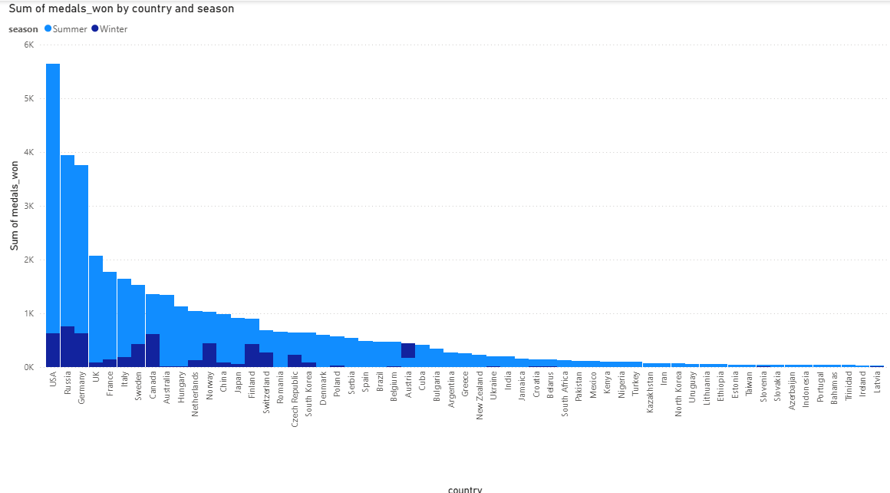

📊 **Key Findings:**  
- USA dominates the summer season winning over 5000 medals in total
- Russia dominates the Winter season

### 25.5. Most medal win types by Country (3 Countries shown only)
🖥️ Query: [25.5_most_win_medal_types_by_country.sql](scripts/25.5_most_win_medal_types_by_country.sql)

- Comapring counties and their medal win types for USA, Russian and Germany

**📈 Visualization:**

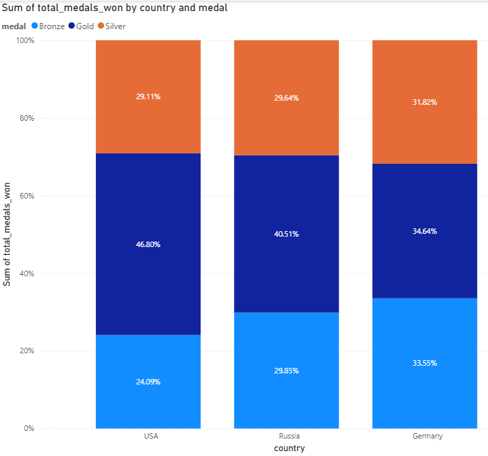

📊 **Key Findings:**  
- USA generally won more gold medals followed by Russia
- Germany won more Silver and Bronze for their total

## Technical Details
- **Database:** PostgreSQL
- **Analysis Tools:** PostgreSQL, Dbeaver, PgAdmin4
- **Visualization:** Microsoft PowerBI for charts